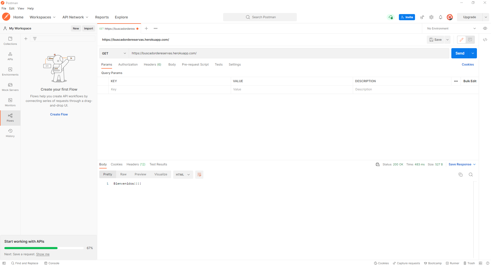
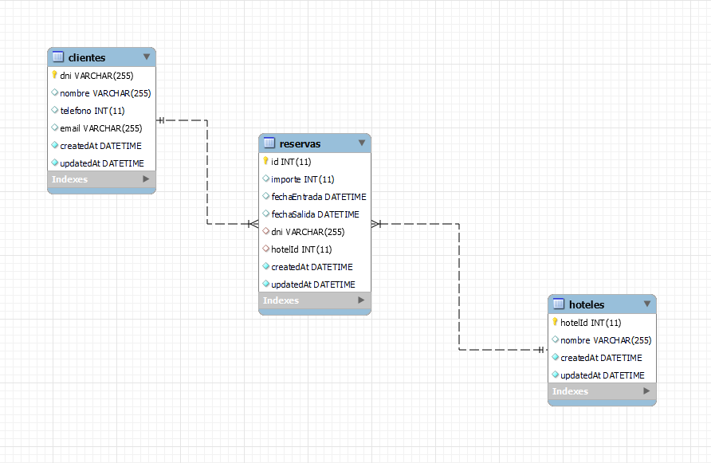

# Toc

- [Toc](#toc)
- [Hotel Booking finder](#hotel-booking-finder)
- [How to use it](#how-to-use-it)
- [Endpoints](#endpoints)
- [Diagram](#diagram)
  - [Author](#author)
      - [Luciano Germani :it:](#luciano-germani-it)

# Hotel Booking finder

*If you prefer you can read this in* [Spanish](README-ESP.md)

This project it's a replication of a serching engine for hotel's booking.

# How to use it

To be able to use it you will need to install Postman ((https://www.postman.com/) and aim to this heroku server: https://buscadordereservas.herokuapp.com/

# Endpoints

Here you can find all the methods you can use on Postman to be able to do your research

GET / reservas --> show all the reservation 
GET / reservas / :id --> show all the ID of the reservations 
GET / reservas / dniCLiente / :dni --> show all the reserve made filter by id
GET / reservas / hotel / :hotelId --> show all the booking made by hotel
GET / reservas / entrada / :fechaEntrada --> show all the check-in 
GET / reservas / salida / :fechaSalida --> show all the check-out

# Diagram

here you can find the diagram of the project

## Author 	

#### [Luciano Germani](https://github.com/Germanilu) :it:

---------------------

[:top:](#toc)

